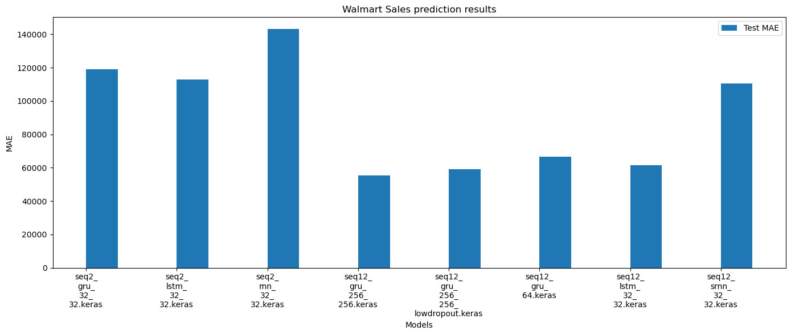
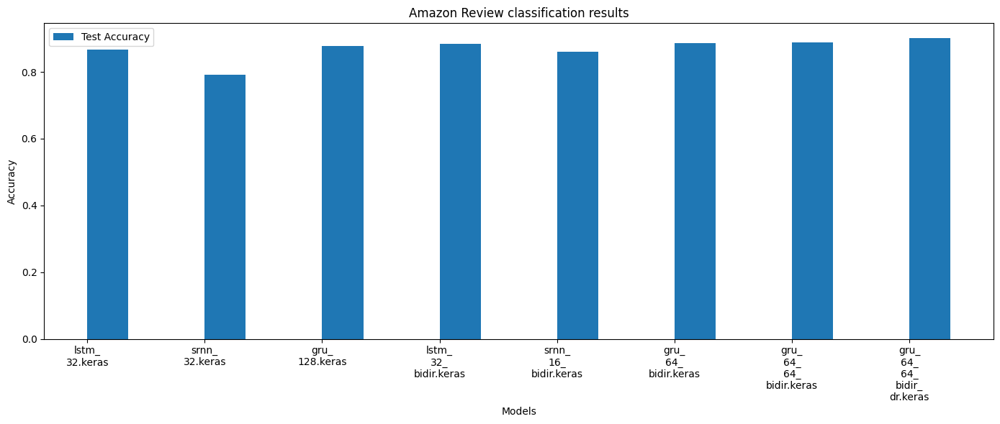

Exploratory Analysis of RNN Capabilities for Classification and Regression
===

This project involves an exploratory analysis of the capabilities of Recurrent Neural Networks (RNNs) for both classification and regression tasks. We use two distinct datasets: one for a regression problem and the other for a classification problem. The aim is to understand the effectiveness of RNNs in handling sequential data for these types of tasks.

## Dataset Description

### Walmart Sales Dataset
The dataset is available here ["Walmart Sales Dataset of 45 Stores"](https://www.kaggle.com/datasets/yasserh/walmart-dataset).
- Description: Contains information about the weekly sales of 45 Walmart stores from 2010 to 2012.
- Features: Weekly sales, holidays, temperature, fuel price, CPI (Consumer Price Index), and unemployment rate.
- Objective: Predict future weekly sales based on historical data and additional factors.

### Amazon Reviews for Sentiment Analysis
The dataset is available here ["Amazon Reviews for Sentiment Analysis"](https://www.kaggle.com/datasets/bittlingmayer/amazonreviews).
- Description: Consists of Amazon customer reviews (input text) and star ratings (output labels).
- Features: Text of the review.
- Objective: Classify the sentiment of the review as positive or negative based on the text.

## Results comparison

### Walmart Sales Dataset



### Amazon Reviews for Sentiment Analysis




## Install the environment in a local device
The following steps must be followed to install the dependencies required for running the application:

1. Navigate to the project directory
```
cd (`project_path`)
```

2. Create a conda environment from a .yml file
```
conda env create -f environment.yml
```

## Project Structure
The project is organized as follows:

```
├── datasets
│   ├── walmart-sales-dataset-of-45stores.csv
│   ├── AmazonDataset
│   │   ├── test_small.txt
│   │   ├── train_small.txt 
├── output
│   ├── "generated models"
```

## Dependencies
The main libraries used in this project include:

- TensorFlow
- Keras
- NumPy
- Seaborn
- Pandas
- Matplotlib

## Model Architecture
The RNN model is designed with the following architecture:

### Regression Model (Walmart Sales)
- Input layer: Takes in sequences of features.
- RNN layers: Multiple RNN layers (e.g., LSTM or GRU) for capturing temporal dependencies.
- Dense layers: Fully connected layers for regression output.

### Classification Model (Amazon Reviews)

- Embedding layer: Converts words into vector representations.
- RNN layers: Multiple RNN layers (e.g., LSTM or GRU) for processing sequences of words.
- Dense layers: Fully connected layers with softmax activation for classification.
